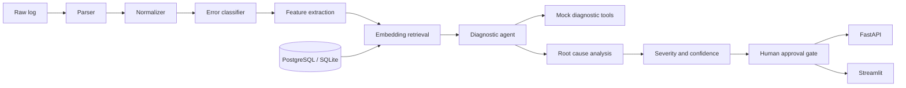

# AI Log Analyzer & Root Cause Analysis Agent

**Status: Completed portfolio implementation with synthetic data and mocked tools**

A production-shaped portfolio project for analyzing synthetic application, API, SQL, SSIS, ETL, and data-quality logs. It combines deterministic parsing and severity rules with retrieval-grounded diagnosis, mocked tool calling, structured observability, FastAPI, Streamlit, SQLAlchemy, PostgreSQL, Docker, and automated evaluation.

> Synthetic data only. The project never connects to production systems and never executes destructive actions.

## Problem

Operational teams often receive a small error fragment with little context. This project turns that fragment into an explainable investigation: what was observed, which historical incidents are similar, what is evidence versus hypothesis, what to check next, and which actions require a human.

## Architecture



## Workflow

1. Validate and reject prompt-injection-like input.
2. Parse job, package, timestamp, message, duration, baseline, and metadata.
3. Normalize the error and classify it using explicit operational patterns.
4. Retrieve similar historical incidents from a deterministic vector index. The embedder is offline and reproducible; FAISS can be added as a drop-in index for larger corpora.
5. Call safe mocked tools for job history, execution metrics, database status, blocking sessions, tickets, and alerts.
6. Produce observed facts, evidence, hypotheses, likely root cause, alternatives, recommendations, severity, and confidence.
7. Gate ticket and alert simulation behind `approve_actions`.

## RAG Design

Historical incidents contain `incident_id`, `timestamp`, `system`, `job`, `error_type`, `error_message`, `root_cause`, `resolution`, `severity`, `duration`, and metadata. The default corpus has 130 incidents in memory and can generate 260+ JSON/log examples with:

- SQL timeout and deadlock
- connection and authentication failure
- API timeout and HTTP 500
- missing or corrupt files
- SSIS/package failure
- network, memory, and disk failures
- data-quality violations

Similarity combines deterministic token embeddings with an error-type match boost. Retrieved incidents are exposed as evidence, while alternative causes remain explicitly labeled as hypotheses.

## Agent and Tool Calling

`DiagnosticAgent` is intentionally small and testable. `DiagnosticTools` provides safe mock results for:

- `search_similar_incidents`
- `get_job_history`
- `get_execution_metrics`
- `get_error_logs`
- `check_database_status`
- `check_blocking_sessions`
- `create_ticket`
- `send_alert`

No restart, database mutation, infrastructure change, or external ticket/alert is performed. Approval only changes a response from `approval_required` to `simulated`.

The `LLMService` is an OpenAI-compatible extension point. Set `LLM_MODE=mock` for the fully offline path. An API-key-backed adapter can be added without changing the API schema or safety gate.

## Root-Cause Output

The API distinguishes:

- **Observed facts:** directly parsed from the input.
- **Evidence:** duration comparisons and retrieved incidents.
- **Hypotheses:** plausible alternatives, never presented as facts.
- **Likely root cause:** the strongest available explanation.
- **Confidence:** bounded integer from 0 to 100.

For the requested sample, the mock mode returns `SQL Timeout`, `HIGH`, `Database query timeout`, evidence that 42 minutes is well above the 8-minute baseline, blocking/index/data-volume alternatives, investigation steps, and approval-gated actions.

## API

- `GET /health`
- `POST /api/v1/analyze` with `{ "raw_log": "...", "approve_actions": false }`
- `GET /api/v1/incidents?limit=50`
- `GET /api/v1/incidents/{incident_id}`
- OpenAPI: `http://localhost:8000/docs`

## Local Setup

```powershell
python -m venv .venv
.\.venv\Scripts\Activate.ps1
pip install -r requirements.txt
Copy-Item .env.example .env
uvicorn main:app --reload
```

In a second terminal:

```powershell
streamlit run streamlit_app/app.py
```

Open `http://localhost:8501` for the dashboard and `http://localhost:8000/docs` for the API.

## Sample Request

```json
{
  "raw_log": "Job: Customer_Load\nPackage: Customer_Master\nTimestamp: 2026-09-15 10:30:00\nERROR:\nSQL timeout expired.\nExecution time: 42 minutes\nExpected execution time: 8 minutes"
}
```

Expected high-level result:

```text
Severity: HIGH
Error Type: SQL Timeout
Likely Root Cause: Database query timeout.
Evidence: Execution duration increased significantly above baseline.
Confidence: 87% or higher
Actions: approval_required
```

## Synthetic Data and Evaluation

Generate hundreds of synthetic records and log files:

```powershell
python scripts/generate_synthetic.py
```

Run the 39-incident evaluation:

```powershell
python evaluation/run_evaluation.py
```

The report is written to `evaluation/results.json` and measures classification accuracy, retrieval precision proxy, root-cause accuracy proxy, severity-related confidence, groundedness, and hallucination rate. The evaluation is intentionally transparent: the root-cause proxy is not presented as a substitute for a human-labeled benchmark.

## Tests

```powershell
pytest -q
```

The suite covers the sample timeout, malformed/unknown logs, action approval, health, API validation, and end-to-end analysis.

## Docker

```powershell
docker compose up --build
```

- API: `http://localhost:8000`
- Dashboard: `http://localhost:8501`
- PostgreSQL: `localhost:5432`

The Compose deployment uses PostgreSQL while local development defaults to SQLite. Configure secrets with environment variables; never commit `.env` or API keys.

## Screenshots

Add portfolio screenshots here after running the dashboard:

- `docs/screenshots/dashboard-overview.png`
- `docs/screenshots/sql-timeout-diagnosis.png`
- `docs/screenshots/openapi.png`

## Security and Reliability

- Pydantic input and output validation.
- Maximum log input length.
- Basic prompt-injection defense for log-shaped input.
- Synthetic-only defaults.
- Environment-based configuration and ignored secrets.
- Approval gate for ticket and alert actions.
- No destructive tools.
- Structured JSON logs and request ID/duration headers.
- Graceful unknown-error fallback and bounded confidence.

## Limitations

The offline embedding model is deterministic rather than semantically rich. Tool results are mocked. The evaluation set is synthetic and partially template-derived. Production use would require an authenticated LLM gateway, real telemetry adapters, durable migrations, rate limiting, RBAC, secrets management, a human-labeled benchmark, and richer incident correlation.

## Future Roadmap

- Add a real FAISS or pgvector index with embedding versioning.
- Add OpenAI-compatible structured-output diagnosis with schema validation and retry budgets.
- Add OpenTelemetry traces and Prometheus metrics.
- Add background ingestion for object storage and SIEM exports.
- Add reviewer feedback capture and calibration dashboards.
- Add CI, image scanning, dependency pin automation, and database migrations.

## Resume Bullets

- Built a synthetic-data AI log analyzer combining FastAPI, Streamlit, SQLAlchemy, PostgreSQL, deterministic embeddings, RAG, and approval-gated diagnostic tools.
- Designed an explainable RCA pipeline that separates observed facts, retrieved evidence, hypotheses, confidence, severity, and recommendations for SQL/SSIS/ETL failures.
- Added 130+ historical incidents, 39-case automated evaluation, structured request observability, Docker Compose, input validation, and safe mock mode without credentials.

## Interview Explanation

The system is deliberately hybrid. Parsing and severity rules are deterministic where correctness matters. Retrieval supplies historical context. The agent synthesizes a diagnosis but cannot mutate infrastructure. Every recommendation identifies its evidence, and every operational action stops at a human approval boundary. This makes the design easier to evaluate, safer to demo, and straightforward to replace with production adapters.

## System Design and Failure Scenarios

- **No similar incident:** return a low-evidence diagnosis with explicit uncertainty and generic investigation steps.
- **Conflicting incidents:** preserve multiple retrieved causes as hypotheses and cap confidence.
- **Database unavailable:** API analysis remains available from the in-memory synthetic corpus; incident listing reports the database failure through the HTTP error path.
- **LLM failure:** mock/deterministic diagnosis remains the fallback.
- **Tool failure or timeout:** tool calls are isolated and no destructive action is retried automatically.
- **Malformed or hostile input:** validation rejects it before analysis.
- **Invalid model output:** Pydantic response validation prevents an unbounded response from reaching the caller.

## Git Commands

```powershell
git init
git add .
git commit -m "Build AI log analyzer and RCA agent"
git branch -M main
git remote add origin https://github.com/suniljavadi/AI-Log-Analyzer-RCA-Agent.git
git push -u origin main
```

## Resume Relevance

Demonstrates Python, FastAPI, Streamlit, SQLAlchemy, deterministic retrieval, RAG-style incident evidence, structured RCA output, approval-gated tools, Docker, observability, and evaluation design for SQL/SSIS/ETL incidents.

## Author and Related Work

**Sunil Javadi** · [GitHub](https://github.com/suniljavadi) · [Portfolio](https://github.com/suniljavadi/sunil-portfolio) · [LinkedIn](https://www.linkedin.com/in/sunil-javadi/)

- [AI Log Analyzer and RCA Agent](https://github.com/suniljavadi/AI-Log-Analyzer-RCA-Agent)
- [Multi-Agent Data Engineering Assistant](https://github.com/suniljavadi/Multi-Agent-AI-Data-Engineering-Assistant)
- [Data Engineering MCP Server](https://github.com/suniljavadi/data-engineering-mcp-server)
